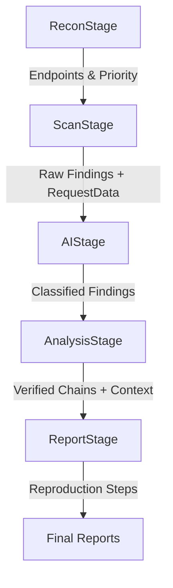

# AI Bug Hunter Architecture

This document provides a technical overview of the **Raven AI security scanner** architecture, detailing its modular pipeline, data flow, and component responsibilities.

---

## 🏗️ 1. Pipeline Flow Overview

Raven AI utilizes a staged execution model orchestrated by `core.Pipeline` and `core.Scheduler`.

### Execution Diagram

### Logical Stages
1.  **ReconStage**: Surface mapping (subdomains) and deep discovery using `HeadlessCrawler` and `JSAnalyzer`. Includes `EndpointPrioritizer`.
2.  **ScanStage**: Active vulnerability probing via `FuzzingEngine` (XSS, SQLi, IDOR, Auth). Captures `request_data` for replay.
3.  **AIStage**: LLM-augmented payload enhancement and evidence analysis using multiple providers.
4.  **AnalysisStage**: Deduplication, risk scoring, and multi-step exploit chaining via `ExploitExecutor` with stateful `ExecutionContext`.
5.  **ReportStage**: Generation of markdown reports via `ReportBuilder` and `ReproductionStepGenerator`.

---

## 📦 2. Module Responsibilities

| Package | Responsibility | Primary Classes |
|---|---|---|
| **`core`** | Pipeline orchestration and scheduler resilience. | `Pipeline`, `Scheduler`, `Settings` |
| **`recon`** | Headless and JS-aware endpoint discovery. | `HeadlessCrawler`, `JSAnalyzer` |
| **`scanner`** | Active fuzzing and vulnerability re-execution. | `FuzzingEngine`, `VulnerabilityReplayer` |
| **`ai`** | Multi-provider LLM integration. | `LLMClient` (OpenAI, OpenRouter, Local) |
| **`analysis`** | Stateful chaining and priority scoring. | `ExploitExecutor`, `ExecutionContext`, `Prioritizer` |
| **`reports`** | Deterministic reproduction step generation. | `ReproductionStepGenerator`, `ReportBuilder` |

---

## 🔄 3. Data Flow Evolution

Raven AI enriches a shared `Target` and `Vulnerability` model throughout the pipeline.

1.  **Endpoint**: Unique URI + Method + Params + Priority.
2.  **Vulnerability**: Type + Evidence + Confidence + **RequestData** (for replayer).
3.  **ExecutionContext**: Maps discovered tokens and states across exploit chains.

---

## 🛠️ 4. Resilience and Safety

1.  **Scheduler**: Implements per-stage retry and skip-on-failure policies.
2.  **Verification Layer**: Discovered bugs are automatically re-tested by `ExploitExecutor` before reporting to ensure NO hallucinations.
3.  **Bug Bounty Mode**: Optimizes scanning for speed and high-impact findings (e.g., Auth/IDOR).
